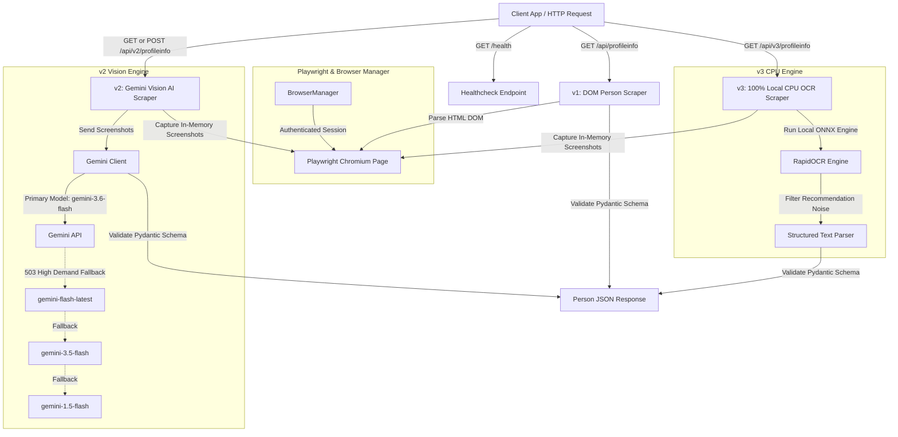

# LinkedIn Profile Viewer REST API

A high-performance, multi-engine REST API server for scraping and parsing LinkedIn person profiles using **Playwright Chromium**, **Gemini Multimodal Vision AI**, and **100% Local CPU OCR**.

---

## 🏛️ System Architecture



---

## 🚀 Features

- **3 Scraping Engines Available**:
  - **v1 (`/api/profileinfo`)**: Fast DOM-based element extraction.
  - **v2 (`/api/v2/profileinfo`)**: Multimodal Vision extraction using Google Gemini API with automatic multi-model fallback retry on 503 high demand.
  - **v3 (`/api/v3/profileinfo`)**: 100% Local CPU OCR using `rapidocr-onnxruntime` (Zero API keys required, zero rate limits, 100% offline).
- **In-Memory Screenshot Processing**: Captures full-page screenshots directly in Python RAM without writing temporary disk files unless debug mode is enabled.
- **Automated Multi-Subpage Capture**: Automatically navigates to main profile, Experience details (`/details/experience`), Education details (`/details/education`), and Contact Info overlay (`/overlay/contact-info/`).
- **Auto-Dependency Installer**: Self-checks and installs missing dependencies on startup.
- **Dual Logging**: Real-time console logs + persistent output written to `api_server.log`.

---

## ⚙️ Setup & Installation

### 1. Clone & Enter Repository
```bash
cd /Users/mangeshpatil/repos/linkedin_profile_viewer
```

### 2. Configure Environment Variables
Copy `.env.example` to `.env` and enter your credentials:
```bash
cp .env.example .env
```

Edit your `.env` file:
```env
# LinkedIn credentials for authentication
LINKEDIN_EMAIL=your_email@example.com
LINKEDIN_PASSWORD=your_password_here

# Google Gemini API Key (Required for v2 Vision API)
GEMINI_API_KEY=your_gemini_api_key_here
GEMINI_MODEL=gemini-3.6-flash

# Save copies of screenshots to debug_screenshots/ directory
SAVE_SCREENSHOTS=true
```

### 3. Install Dependencies
```bash
pip install -r requirements.txt
playwright install chromium
```

---

## 🖥️ Running the Server

Start the API server:
```bash
python3 api_server.py
```
The server will start at `http://localhost:8000`.

---

## 📡 REST API Reference

### 1. Healthcheck
```http
GET /health
```
**Response**:
```json
{
  "status": "healthy",
  "browser_active": true
}
```

---

### 2. v1 DOM Scraper
```http
GET /api/profileinfo?profileUrl=https://www.linkedin.com/in/williamhgates/
```

---

### 3. v2 Gemini Vision AI Scraper
```http
GET /api/v2/profileinfo?profileUrl=https://www.linkedin.com/in/williamhgates/&model=gemini-3.6-flash
```

**POST Variant**:
```http
POST /api/v2/profileinfo
Content-Type: application/json

{
  "url": "https://www.linkedin.com/in/williamhgates/",
  "gemini_api_key": "optional_api_key_override",
  "model": "gemini-3.6-flash"
}
```

---

### 4. v3 100% Local CPU OCR Scraper (No Gemini API Needed!)
```http
GET /api/v3/profileinfo?profileUrl=https://www.linkedin.com/in/williamhgates/
```

---

## 📋 Person JSON Output Schema

All scrapers return a validated JSON object matching this schema:

```json
{
  "status": "success",
  "data": {
    "linkedin_url": "https://www.linkedin.com/in/williamhgates/",
    "name": "Bill Gates",
    "headline": "Co-chair, Bill & Melinda Gates Foundation",
    "location": "Seattle, Washington, United States",
    "profile_picture_url": "https://media.licdn.com/dms/image/...",
    "connections": "500+ connections",
    "about": "Co-chair of the Bill & Melinda Gates Foundation...",
    "open_to_work": false,
    "experiences": [
      {
        "position_title": "Co-chair",
        "institution_name": "Bill & Melinda Gates Foundation",
        "from_date": "2000",
        "to_date": "Present",
        "duration": "24 yrs",
        "location": "Seattle, WA",
        "description": "Guiding foundation strategies and grantmaking..."
      }
    ],
    "educations": [
      {
        "institution_name": "Harvard University",
        "degree": "Pre-law, Computer Science",
        "from_date": "1973",
        "to_date": "1975",
        "description": "Attended 1973–1975"
      }
    ],
    "contacts": [
      {
        "type": "LinkedIn",
        "value": "https://www.linkedin.com/in/williamhgates/"
      }
    ]
  }
}
```

---

## 🧪 Testing

Run automated unit and endpoint tests:
```bash
pytest tests/test_api_server.py
```

---

## 🚢 Production Deployment

### Quickstart with Docker & Docker Compose:
```bash
docker-compose up -d --build
```

For detailed deployment instructions on **AWS EC2**, **DigitalOcean VPS**, **Systemd services**, and **Render / Railway / Fly.io**, see [DEPLOYMENT.md](file:///Users/mangeshpatil/repos/linkedin_profile_viewer/DEPLOYMENT.md).
